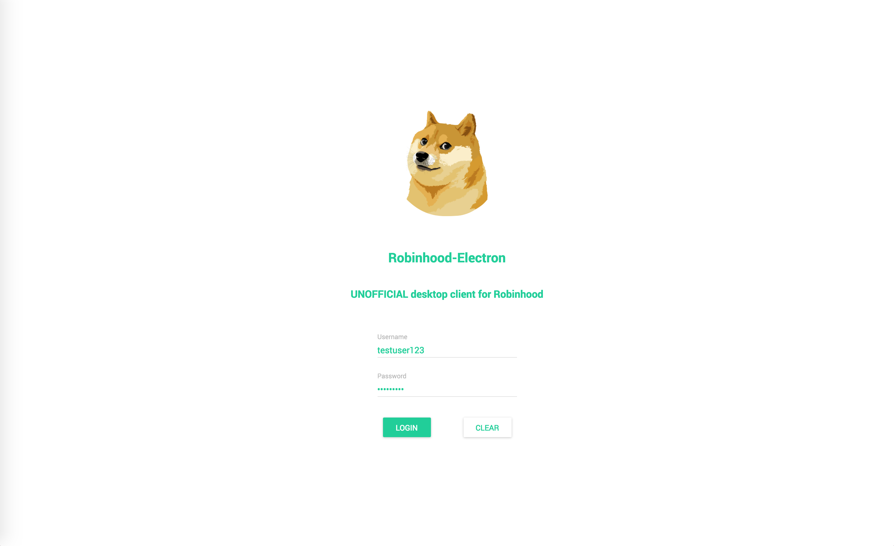
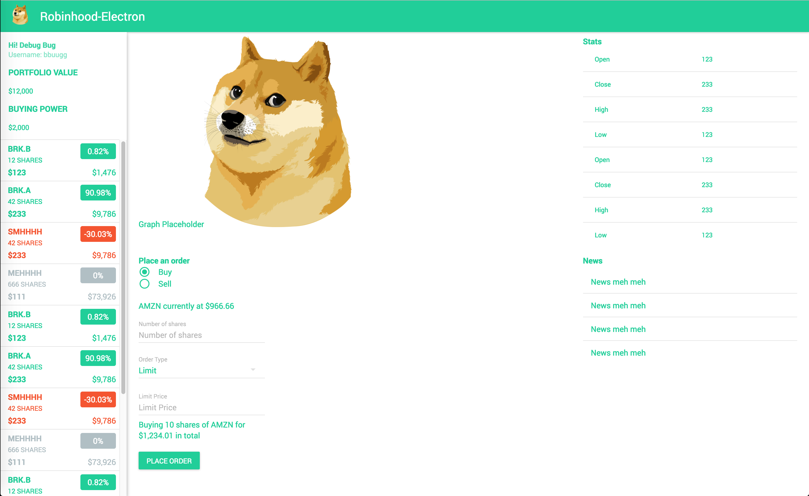

# Robinhood-Electron
Building a desktop client for Robinhood, planning to support Mac and Windows.

Backend API using [robinhood-node](https://github.com/aurbano/robinhood-node). Frontend implemented with Electron, React-Redux.

Project is put on hold because Robinhood is planning to release a web interface next year. Gonna start a new serverside project focusing on managing my account and automating trades.

## Planned Features:
 - Login to Robinhood (done)
 - View Simple Portfolio List (done)
    - LeftNav should be displaying all info correctly now, price percentage numbers are calculated using extended hours if available
    - Watchlist and adding symbols outside the existing portfolio will be added later after implementing simple trading
 - Simple Trading  
 - Graphical Portfolio UI with Charts
 - Complex Trading with Customizable Orders
  
## Screenshots 
#### Appreciate the doge I stole from the Internet, please don't copyright it :(
 - Current login page
 
 - Current Main page design with placeholder data. Only the left nav is fully functional at the moment.
 
